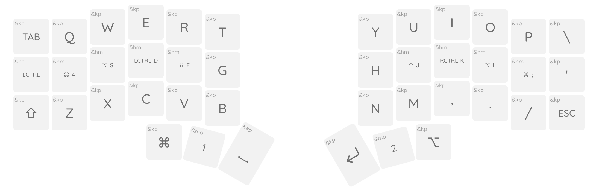

# My Colemak DHm

This is a customization of the ZMK config for the Corne keyboard with machine
readable layout and keymap definitions for use with [keymap-editor] tool.

This repo defines the Colemak DHm layout, and adds support for nice_view lcd
displays

TODO: replace the screenshot with actual layout
 

## What's included

This repo provides my corne 6x3 keymap ([`config/corne.keymap`]), and a metadata
file ([`config/corne.json`]) to describe the layout and other features of a corne
keyboard in a way that the keymap editor can use.

[keymap-editor]:https://github.com/nickcoutsos/keymap-editor
[keymap-layout-tools]:https://nickcoutsos.github.io/keymap-layout-tools/
[`config/corne.keymap`]:config/corne.keymap
[`config/corne.json`]:config/corne.json
[template]:https://github.com/nickcoutsos/keymap-editor-demo-crkbd/generate
